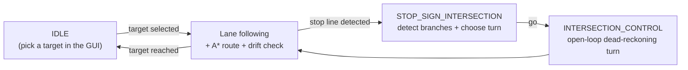

# Graph-Based Autonomous Navigation & SLAM in Duckietown


[](LICENSE.md)

Point-to-point autonomous driving for a [Duckiebot](https://www.duckietown.com/), in
simulation and on real hardware. You pick a destination in a small desktop GUI; the robot
plans a route over a map it built earlier, follows the lane to get there, reads each
intersection from the camera to decide where to turn, and re-plans automatically if it
drifts off route.

This repository is a fork of the official [`duckietown/dt-core`](https://github.com/duckietown/dt-core)
stack. It extends the built-in **indefinite navigation** demo — which only does lane
following plus *random* AprilTag-driven turns — into a **goal-directed graph navigation
pipeline** that does not rely on AprilTags to decide turns.

> **Status:** student research project, built for the Master's practical
> [*Autonomous Robotics with Duckietown*](https://uni-tuebingen.de/fakultaeten/mathematisch-naturwissenschaftliche-fakultaet/fachbereiche/informatik/lehrstuehle/autonomous-vision/projects/autonomous-robotics-with-duckietown/)
> (Autonomous Vision Group, University of Tübingen, summer semester 2026). It works
> end-to-end in simulation and, more roughly, on real hardware, but it is not a finished
> product — see [Project status & limitations](#project-status--limitations). Maps are
> pre-recorded for a specific track, so this is not turnkey for an arbitrary Duckietown.


---

## Contents

- [Demos](#demos)
- [What it does](#what-it-does)
- [How it works](#how-it-works)
- [Repository layout](#repository-layout)
- [Prerequisites](#prerequisites)
- [Build](#build)
- [Running it](#running-it)
- [Building a map (offline)](#building-a-map-offline)
- [Configuration](#configuration)
- [Results](#results)
- [Project status & limitations](#project-status--limitations)
- [Report, authors & acknowledgements](#report-authors--acknowledgements)
- [License & attribution](#license--attribution)

---

## Demos

<!-- ───────────────────────────────────────────────────────────────────────────
     HOW TO ADD AN INLINE VIDEO (no external host, plays right here on GitHub):
       1. Open the "new issue" page for this repo (you don't have to submit it):
          github.com/NilsKlute/SLAM_and_EKF_Navigation_Duckietown/issues/new
       2. Drag your .mp4 into the comment box. Wait for the upload bar to finish.
       3. GitHub inserts a line like:
            https://github.com/user-attachments/assets/1a2b3c4d-....
          Copy that whole URL. (Close the issue tab without submitting.)
       4. Replace the matching "PASTE ... URL HERE" line below with that bare URL,
          on its own line, with a blank line above and below it.
     Do NOT link Google Drive here — Drive URLs render as a plain link, not a player.
──────────────────────────────────────────────────────────────────────────── -->

**SLAM localization — full run in simulation** (target selection → planning → lane following →
intersection turns → arrival):

https://github.com/user-attachments/assets/8bdb3069-98a5-450b-8ad1-90124471abdb

**EKF localization — full run in simulation** (same task, EKF baseline):

https://github.com/user-attachments/assets/c5125406-d477-4121-a0fd-27fba012de4b

📁 **Full-resolution recordings:** [Google Drive](https://drive.google.com/drive/folders/1jkUJrcD9GWGaGRWOHJkgdDUT1D7-FU63?usp=sharing)

---

## What it does

From a user's point of view:

- **Pick a target and go.** A desktop GUI ([`target_gui_node`](packages/navigation/src/target_gui_node.py))
  lists named destinations on the map (`Top Left`, `Middle Middle`, `Bottom Right`, …).
  Select one and the robot plans a route and starts driving.
- **Plans routes over a graph.** An **A\*** planner searches a directed roadmap of the town,
  with a no-U-turn rule so it respects one-way lane flow.
- **Reads intersections from the camera — no AprilTag turn rules.** At each stop line a
  perception node inspects the image to detect which branches physically exist
  (`Left` / `Straight` / `Right`); the planner then chooses the maneuver that follows the
  route using a lookahead along the path.
- **Re-plans on drift.** While lane following, the planner continuously matches the
  vehicle's pose and heading against the graph. If it falls off the planned route it
  re-runs A\* from the nearest matching node — without stopping.
- **Two localization modes.** A monocular **SLAM** pipeline (RTAB-Map) and, as a baseline,
  an **EKF** that fuses wheel odometry with AprilTag range/bearing updates.
- **Runs in sim and on a real bot.** Every node ships separate `myduckiebot.yaml`
  (simulation) and `roboduck.yaml` (real robot) configs.

---

## How it works

The stack runs on top of the Duckietown **Finite State Machine (FSM)**. One end-to-end
cycle:

<!-- If you have a rendered image of the actual FSM graph you built, drop it in at
     assets/demo/fsm.png and replace the Mermaid block below with:
     
     Keep whichever reads more clearly — the real graph is more authentic, the Mermaid
     one is simpler if the real graph is dense. -->



Pipeline stages and the nodes that implement them:

| Stage | What happens | Node / source |
|---|---|---|
| **Offline mapping** | Build a roadmap up front. **SLAM maps are built in a separate repo** ([`duckietown-rtabmap-slam`](https://github.com/NilsKlute/duckietown-rtabmap-slam)) and exported to a pose graph; **EKF** graphs come from ground-truth poses (sim) or are drawn by hand (real). Poses are clustered into a clean directed graph. | `graph_planner_node` preprocessing + [`duckietown-rtabmap-slam`](https://github.com/NilsKlute/duckietown-rtabmap-slam) |
| **Localization** | Estimate global pose `(x, y, θ)` while driving — SLAM loop closures or EKF + AprilTags | [`ekf_localization_node.py`](packages/navigation/src/ekf_localization_node.py), [`deadreckoning_node.py`](packages/navigation/src/deadreckoning_node.py) |
| **Planning & drift** | A\* route, pose-to-graph matching, automatic replanning, lookahead turn decisions | [`graph_planner_node.py`](packages/navigation/src/graph_planner_node.py) |
| **Intersection perception** | Anti-Instagram → HSV red masking → DBSCAN clustering → line fitting to find branches | [`intersection_type_detector_node.py`](packages/navigation/src/intersection_type_detector_node.py) |
| **Turn execution** | Open-loop dead-reckoning turn profiles (calibrated ω + duration) | [`unicorn_intersection_node.py`](packages/unicorn_intersection/src/unicorn_intersection_node.py) |
| **Target selection & debug GUI** | Choose destinations, step through intersection decisions | [`target_gui_node.py`](packages/navigation/src/target_gui_node.py) |

For the full method — spatial-angular keyframe clustering, the belief-propagation tile-graph
reconstruction, drift thresholds, and all tuned parameters — see the
[technical report](#report-authors--acknowledgements).

---

## Repository layout

Only the parts we added or substantially changed; the rest is upstream `dt-core`.

```
packages/
  navigation/                 # planning, localization, mapping, target GUI
    src/
      graph_planner_node.py         # A* + clustering + drift + lookahead turns
      intersection_type_detector_node.py  # vision-based branch detection
      ekf_localization_node.py      # EKF localization (baseline)
      deadreckoning_node.py         # wheel-encoder odometry
      target_gui_node.py            # desktop target-selection / debug GUI
    include/navigation/       # EKF filter, BEV/SLAM helpers, tile-graph mapping
    config/graph_planner_node/      # graphs (.g2o / .yaml) + label maps per robot
  unicorn_intersection/       # open-loop intersection turn execution
  stop_line_filter/           # stop-line detection tuning
  lane_control/, line_detector/, fsm/   # tuned configs for this project
launchers/
  SLAM_localization.sh        # run the stack with SLAM localization
  EKF_localization.sh         # run the stack with EKF localization
run_target_gui.sh             # launch the target-selection GUI on your laptop (edit IPs inside)
```

---

## Prerequisites

This is a standard Duckietown `dt-core` project (Duckietown distro **`ente`**, ROS Noetic).
If you have never set up Duckietown before, follow the official docs — we don't duplicate
them here:

- **Docker** — [install guide](https://docs.docker.com/get-docker/)
- **Duckietown Shell (`dts`)**, **Duckiematrix** and account setup — [Duckietown operation manual](https://docs.duckietown.com/)
- **A real Duckiebot** (optional) — flashed, calibrated (camera + wheels), and reachable at
  `roboduck.local`
- **SLAM stack** (only for SLAM mode) — [`duckietown-rtabmap-slam`](https://github.com/NilsKlute/duckietown-rtabmap-slam),
  a separate Duckietown container that builds the map and, at run time, publishes the
  loop-closure-corrected pose this stack localizes against. Not needed for EKF mode.

Confirm your shell and (if using hardware) your bot are up to date:

```bash
dts update
dts desktop update
dts duckiebot update roboduck        # real robot only
```

---

## Build

Clone and build the image locally. The run commands below use `-R` (the container runs on
your laptop, not on the robot), so a local build with `-f` is what you want for **both**
simulation and the real robot:

```bash
git clone https://github.com/NilsKlute/SLAM_and_EKF_Navigation_Duckietown.git
cd SLAM_and_EKF_Navigation_Duckietown

dts devel build -f
```

---

## Running it

The project ships two launchers. Pick one with `-L` depending on which localization you
want:

| Localization | Launcher | Notes |
|---|---|---|
| **SLAM** | `SLAM_localization` | RTAB-Map localization against a pre-built map |
| **EKF** (baseline) | `EKF_localization` | wheel odometry + AprilTag updates |

> **SLAM mode needs a second container.** This stack does not localize on its own in SLAM
> mode — it subscribes to `/rtabmap/localization_pose`. You must **also** run the
> [`duckietown-rtabmap-slam`](https://github.com/NilsKlute/duckietown-rtabmap-slam) container (its `localization`
> launcher), pointed at your prebuilt map database, at the same time. EKF mode is
> self-contained.

**About `-R` and the `/data` mount.** Every command below runs the stack with
`dts devel run -R <robot>`, which launches the container **on your laptop** (connected to the
virtual or real robot over the network) rather than on the robot itself. In that mode the
persistent `/data` directory that normally lives on the robot isn't present, so you **mount
your own volume to `/data`** with a trailing `-- -v <volume>:/data`. The nodes use it to read
and persist maps, graphs and logs. Use a **named Docker volume** in simulation and a **host
folder** on the real robot.

### In simulation

1. **Start the Duckiematrix** with a `loop` map — the bundled graphs were built for the loop
   track. This repo ships maps under [`assets/duckiematrix/maps/`](assets/duckiematrix/maps/)
   (`loop`, `intersections`, `loop_with_pedestrians`); point `--map` at the loop one:

   ```bash
   dts matrix run --standalone --map <path-to>/loop
   ```

2. **Create the virtual robot once, then start and attach it** (`myduckiebot`):

   ```bash
   dts duckiebot virtual create myduckiebot    # one-time setup
   dts duckiebot virtual start  myduckiebot
   dts matrix attach myduckiebot map_0/vehicle_0
   ```

   Stop it later with `dts duckiebot virtual stop myduckiebot`. You can drive the bot
   manually inside the Duckiematrix window, and the target GUI shows the camera feed, so no
   separate teleop or image-viewer step is needed.

3. **Run the stack** — EKF baseline or SLAM:

   ```bash
   # EKF baseline
   dts devel run -R myduckiebot -L EKF_localization  -- -v dts-virtual-myduckiebot-data:/data
   # SLAM (also start the duckietown-rtabmap-slam container — see the note above)
   dts devel run -R myduckiebot -L SLAM_localization -- -v dts-virtual-myduckiebot-data:/data
   ```

### On a real robot

Power on `roboduck` and make sure it is reachable, then run the stack locally against it,
mounting a host folder for `/data`:

```bash
# EKF baseline
dts devel run -R roboduck -L EKF_localization  -- -v /path/to/roboduck_data:/data
# SLAM (also start the duckietown-rtabmap-slam container — see the note above)
dts devel run -R roboduck -L SLAM_localization -- -v /path/to/roboduck_data:/data
```

### Selecting a target

The robot boots in joystick-override mode (`NORMAL_JOYSTICK_CONTROL`). To drive it
autonomously, run the target GUI **on your laptop**. It runs inside this project's container,
joined to the robot's ROS master, via the helper script:

```bash
./run_target_gui.sh
```

Edit the variables at the top of [`run_target_gui.sh`](run_target_gui.sh) first: robot name
(`myduckiebot` in sim / `roboduck` on hardware), the robot's **current IP** (it changes per
session), and your laptop's IP.

Then:

1. Toggle **autonomous mode** (switches the FSM out of joystick override into `IDLE`).
2. Pick a destination from the dropdown (`Top Left` … `Bottom Right`).
3. The planner computes an A\* route and lane following starts.

The GUI also has a **step-through debug mode** that pauses at each stop line and draws the
lookahead vector and turn-decision cone, so you can confirm the planner's choice before it
executes (useful in sim; see Figure 1 in the report). In simulation you can additionally
enable ground-truth localization.

---

## Building a map (offline)

The planner drives over a graph prepared **before** navigation. This repo already ships the
graphs we used, built **in simulation for the Duckiematrix `loop` map**. Building your own is
a manual, track-specific process, and it differs by localization mode.

**SLAM.** The map is built and localized against in a **separate repository**,
[`duckietown-rtabmap-slam`](https://github.com/NilsKlute/duckietown-rtabmap-slam): drive the town to record an
RTAB-Map database, correct and close loops by hand in `rtabmap-databaseViewer`, then export
the pose graph (`export_pose_graph.sh` → `rtabmap-export`) to a `.g2o` file. That `.g2o`
([`manual_SLAM_loop_*.g2o`](packages/navigation/config/graph_planner_node/)) is what this
planner loads. At run time the *same* database is used by the RTAB-Map container for
localization — so the SLAM "map" exists in two forms: the `.db` (localization, lives in the
RTAB-Map container, not version-controlled) and the exported `.g2o` (planning, in this repo).

**EKF.** In simulation we used **ground-truth pose graphs** from the Duckiematrix; on the
real robot we **drew the pose graph by hand** for the physical city. These live as
[`ekf_loop_*.txt` and `graph_ekf_*.yaml`](packages/navigation/config/graph_planner_node/).

**In both modes**, raw poses are condensed by spatial-angular clustering (e.g. ~21k EKF
frames → ~120 nodes) and linked into a directed graph, and destinations are named in
[`label_map_slam.yaml`](packages/navigation/config/graph_planner_node/label_map_slam.yaml) /
[`label_map_ekf.yaml`](packages/navigation/config/graph_planner_node/label_map_ekf.yaml) so
they appear in the GUI. Kirian's alternative tile-graph pipeline (RTS smoothing + loopy
belief propagation over Duckietown tile priors) is described in the report (Appendix B).

Pre-built graphs live in
[`packages/navigation/config/graph_planner_node/`](packages/navigation/config/graph_planner_node/).
Full method: report Sections 2.1–2.4 and Appendix B.

---

## Configuration

Parameters are split two ways, and both matter:

- **Simulation vs. real hardware** — most nodes have `myduckiebot.yaml` (virtual) and
  `roboduck.yaml` (real) files; the launcher picks the right one from the robot type.
- **EKF vs. SLAM mode** — separate graph/label files and planner tolerances per mode.

The [`configs/`](configs/) directory symlinks the most-tuned nodes for convenience
(`graph_planner`, `ekf_localization`, `intersection_type_detector`, `lane_controller`,
`stop_line_filter`, `unicorn_intersection`, `fsm`).

Every threshold, gain, and noise covariance — for both environments and both modes — is
tabulated in **Appendix A of the technical report**. Start there rather than reverse-
engineering values from the YAML.

---

## Results

18 autonomous runs in simulation across 18 start/target pairs (9 target regions), comparing
the two localization modes. *Arrival accuracy* counts reaching the target (including via
replanning); *intersection turn precision* counts taking the turn the planner intended.

| Metric | EKF (baseline) | SLAM |
|---|---|---|
| Arrival accuracy | 0.38 | **0.83** |
| Intersection turn precision | 0.78 | **0.96** |

SLAM localization was more consistent and precise than our EKF implementation, and
navigation on top of it performed markedly better. Method and protocol details are in the
report.

---

## Project status & limitations

This was a one-semester project and implementation is **not complete**. Known limitations,
stated plainly:

- **Manual loop closure.** Monocular RTAB-Map couldn't close loops automatically (no metric
  3D points for geometric verification), so loop closures were injected by hand.
- **Hardcoded, open-loop turns.** Intersection maneuvers are dead-reckoned at calibrated
  ω/duration. They can't recover from a tilted or off-center pose at the stop line.
- **Stop-line detection isn't fully robust.** It occasionally fires on the red of an
  AprilTag stop sign rather than a real stop line.
- **Not turnkey.** Graphs and calibration are specific to our track and sim; running on a
  different map requires re-recording and re-tuning.

**Next steps** we'd pursue: autonomous exploration/mapping instead of manual loop closure,
and closed-loop (feedback) intersection traversal to replace the hardcoded turns.

---

## Report, authors & acknowledgements

**Technical report:** [Graph-Based Autonomous Navigation and SLAM in Duckietown (PDF)](docs/written_report.pdf)

**Course context:** developed for the Master's practical
[*Autonomous Robotics with Duckietown*](https://uni-tuebingen.de/fakultaeten/mathematisch-naturwissenschaftliche-fakultaet/fachbereiche/informatik/lehrstuehle/autonomous-vision/projects/autonomous-robotics-with-duckietown/)
(9 ECTS) offered by the **Autonomous Vision Group** (Department of Computer Science,
University of Tübingen), summer semester 2026. The practical has small teams design and
implement a complete autonomous driving pipeline — ROS software engineering, computer vision,
localization and mapping, planning and control — on the Duckietown platform; this repository
is our team's pipeline.

**Authors:** Kirian Fink, Nils Klute, Arda Agacdelen.

- **Kirian Fink** — online mapping & belief-propagation refinement (RTS smoothing, tile
  fitting, loopy belief propagation).
- **Nils Klute** — SLAM mapping & localization; the intersection perception pipeline; open-loop turn calibration; RTAB-Map / VINS-Mono
  evaluation; integration, testing and experimentation of the end-to-end pipeline
- **Arda Agacdelen** — graph preprocessing & path planning; no-U-turn A\*, lookahead turn
  logic, replanning; FSM integration; the interactive target/debug GUI.

Built on the Duckietown platform and the [`duckietown/dt-core`](https://github.com/duckietown/dt-core)
stack; the navigation pipeline extends the upstream *indefinite navigation* demo.

---

## License & attribution

This is a fork of [`duckietown/dt-core`](https://github.com/duckietown/dt-core) and is
governed by the **Duckietown Software Terms of Use (v2.0)** — a custom Duckietown license
covering personal, educational, and research use (no commercial use without a separate
agreement). See [`LICENSE.md`](LICENSE.md) for the readable summary and
[the original PDF](docs/duckietown-software-terms-v2.0.pdf); the complete formal terms are at
<https://duckietown.com/sw-license/>.

This work is a Master's course/research project and acknowledges the Duckietown Project as its
terms require. It is not affiliated with or endorsed by Duckietown.
